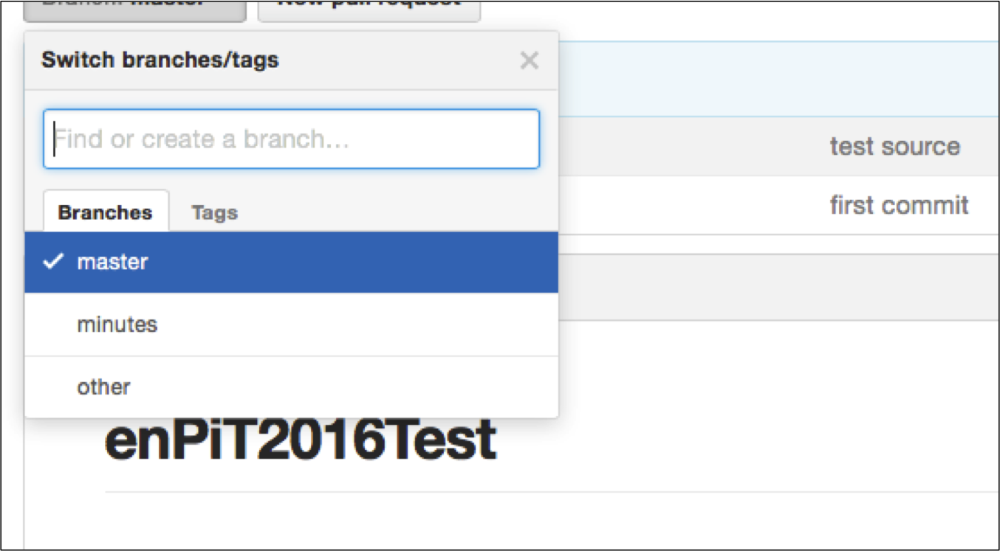
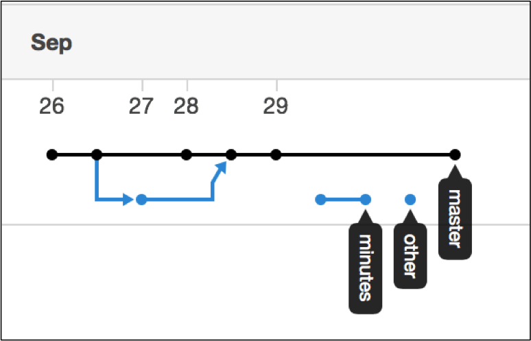

# GitHub運用ルール

## 目次
1. [成果物のリポジトリ管理](#repo)
2. [Issue発行ルール](#issue)
3. [議事録フォーマットの利用](#format)

## 成果物のリポジトリ管理<div id="repo"/>
* ソースコード、議事録、その他の成果物をすべてGitHubで管理する
	* すべての成果物を追跡可能にする
* それぞれ別々のブランチにて管理する
	* 空ブランチを作成し、それを利用する
	* ブランチ名と管理対象ファイルの対応は以下の通り

| ブランチ名 | 管理対象 |
| :--: | :--: |
| master | ソースコード(初期ブランチを利用) |
| minutes | 議事録 |
| other | その他成果物 |


<center>図1：作成したブランチ例</center>

* 空ブランチは以下のコマンドで作成する

```bash:
git checkout --orphan (branch-name) 
```

* 成功すると図2のようなブランチ構成になる

<center>図2：ブランチ構成例</center>

## Issue発行ルール<div id="issue"/>
* タスク管理をGitHubのIssue機能で行う
* Issue発行時にはAssignees，Labels，Milestoneを必ず設定する
	* **Assignees**
		* 該当タスクの担当者を必ずすべて設定する
		* 担当者が決定し難い場合、責任者を決めその人を設定する
	* **Labels**
		* 対象タスクに該当する開発工程とタスクの重要度を必ず設定する
		* 開発工程
			* 要件定義、設計、開発の三種類のうち、いずれかを設定する
		* 重要度
			* 重要度低、重要度高、重要度緊急の三種類のうち、いずれかを設定する
				* 重要度を設定しなかった場合は”重要度普通”と判断する
	* **Milestone**
		* 該当タスクの期限を必ず設定する
		* カリキュラムに設定されている各演習時間を事前にMinestoneとして設定し、必要に応じて新しく追加する

## 議事録フォーマットの利用<div id="format"/>
* 各会議で必ず議事録を作成する
* 議事録作成の際には必ず該当工程用の議事録フォーマットを利用する
	* 議事録フォーマットは[こちら](./minutes)
* 議事録はマークダウン形式で記述する
* ファイル名は「2016/○○/○○ 議事録.md」のように設定する
